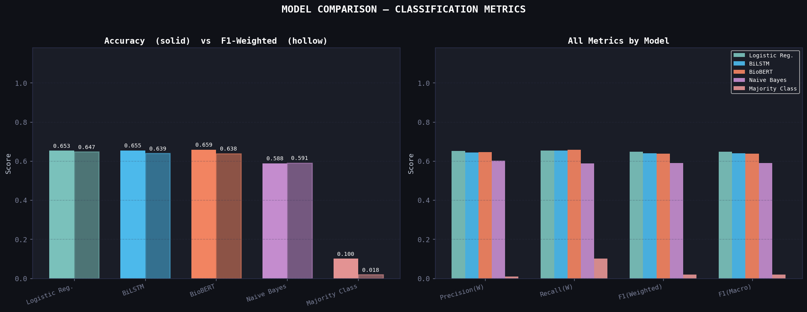
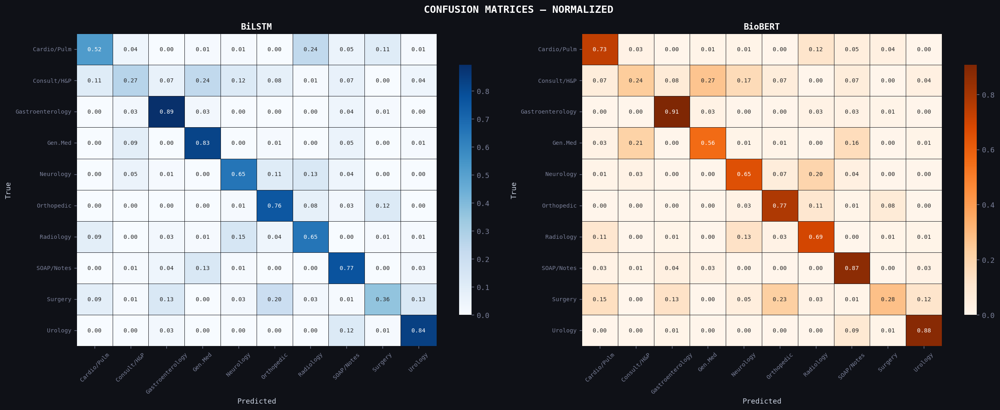
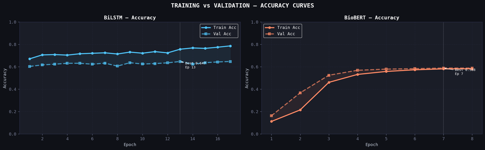

# 🏥 Clinical Triage NLP System  
### AI-Powered Medical Specialty Prediction

<p align="center">
  
  
  
  
</p>

---

## 🚀 What it does
An intelligent NLP system that:
- Converts **free-text symptoms → medical specialty**
- Assists in **automated hospital triage**
- Outputs **prediction + confidence score**

```

Input:  "Chest pain and shortness of breath"
Output: Cardiology (0.82)

```

---

## 🧠 Models
- **BiLSTM + GloVe** → Sequential understanding  
- **BioBERT** → Context-aware medical NLP  
- **Baselines** → Logistic Regression, Naive Bayes  

---

## 📊 Performance

| Model | Best Validation Accuracy |
|------|--------------------------|
| 🥇 BioBERT | **67.20%** |
| 🥈 BiLSTM | 64.67% |

---

## 📈 Visual Insights

### 🔹 Model Comparison


### 🔹 Confusion Matrix


### 🔹 Training Curves


---

## ⚙️ Pipeline
```

Text → Clean → Tokenize → Encode → Train → Evaluate → Predict

````

---

## 🏗️ Tech Stack
`Python` `PyTorch` `Transformers` `Scikit-learn` `Matplotlib`

---

## ▶️ Run in Colab
```python
!pip install transformers torch scikit-learn pandas numpy matplotlib seaborn
````

Run all cells → Models train → Results generated ✅

---

## 🎯 Highlights

* ⚡ End-to-end NLP pipeline for healthcare
* 🧠 BiLSTM vs BioBERT comparison
* 📊 Balanced dataset (10 specialties)
* 📉 Rich visual analytics

---

## 🔮 Future Scope

* Explainability (SHAP/LIME)
* Streamlit deployment
* ClinicalBERT / Ensemble models

---

## ✨ Why it matters

Improves **triage accuracy**, reduces **manual effort**, and enables **faster patient routing**.


<p align="center">
  ⭐ Star this repo if you found it useful!
</p>
```
